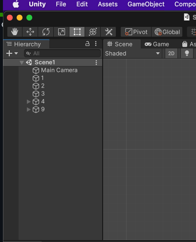
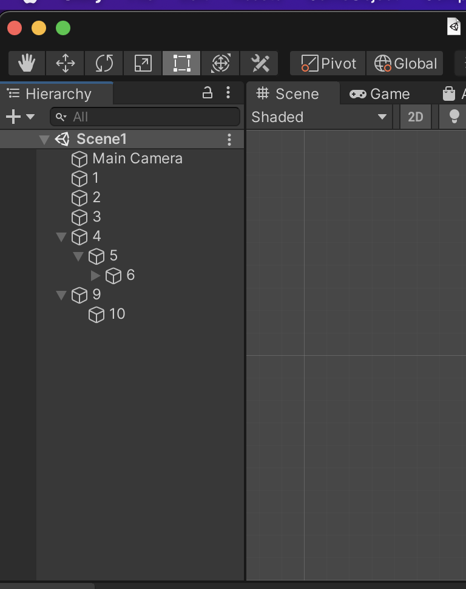

# HierarchyRestore

HierarchyRestore is an editor extension for Unity that can be used to persist expand/collapse states of GameObjects in Scene Hierarchy.

If you are working on multiple Unity scenes, designing scenes, gameplay, environment, switching scenes or reloading project will collapse all your gameobject in scene hierarchy by default. Thanks to Hierarchy Restore who persist gameobjects states and you can focus on your work with context switching.

# How to use

Download the latest `HierarchyRestorer.unitypackage ` files from [releases](https://github.com/rohitvishwakarma1819/HierarchyRestore/releases). Double click on it and you are done.

Example

- Normal Unity behaviour . . . . . . . . . . . . . . . . . . . . . . . . . vs . . . . . . . . . . . . . . . . . . . . . . After Using Hierarchy Restore

 

 

# Suggesting Improvements

To file bugs, make feature requests, or to suggest other improvements, please use [github's issue tracker](https://github.com/rohitvishwakarma1819/HierarchyRestore/issues)

# Want to support my work

1. 

2. Please star this repository ⭐️⭐️⭐️

 

# Made with ♥️ by Rohit Vishwakarma
